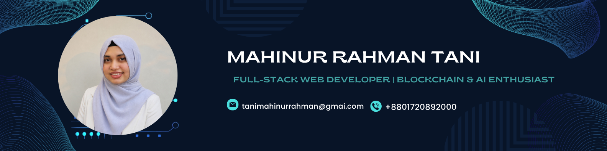

<!-- Banner Image -->

# Hi, I'm Tani Rahman

### Full-Stack Web Developer | AI Integration | Blockchain & Enterprise Systems

Chattogram, Bangladesh  
Email: **tanimahinurrahman@gmail.com**

---

## About Me

I'm a **Full-Stack Web Developer** interested in building practical, reliable, and scalable software applications.

My experience includes **frontend development, backend engineering, database systems, WordPress, AI integration, and blockchain-based applications**.

I work with technologies such as **JavaScript, Node.js, Express.js, PostgreSQL, Sequelize, Hyperledger Fabric, Docker, React, and WordPress**.

I'm particularly interested in applying **Artificial Intelligence and Blockchain** to solve real-world problems involving data integrity, enterprise systems, automation, and secure digital workflows.

I enjoy learning by building projects, exploring new technologies, and continuously improving my software engineering skills.

---
## Skills

### Languages

  

### Frontend

  

### Backend

  

### Database

  

### Blockchain & Infrastructure

  

  

### AI

  

### Tools

  

# Project 1. ERP Blockchain System

**ERP Blockchain System** is a blockchain-integrated enterprise application designed to improve **transaction integrity, policy-based approval, auditability, and secure transaction verification**.

The system combines traditional ERP transaction management with **Hyperledger Fabric** to provide a blockchain-based audit layer for enterprise transactions.
